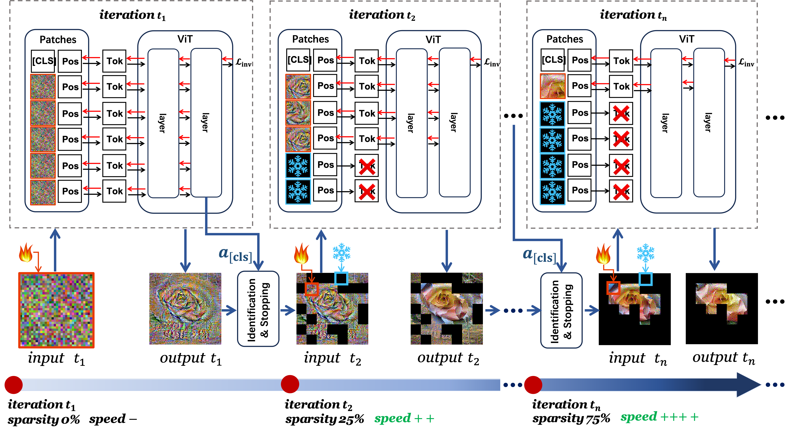

# [ICML 2024] Sparse Model Inversion: Efficient Inversion of Vision Transformers for Data-Free Applications

Official code of Sparse Model Inversion: Efficient Inversion of Vision Transformers for Data-Free Applications

Refer to our [paper](https://openreview.net/pdf?id=T0lFfO8HaK), [poseter](https://icml.cc/media/PosterPDFs/ICML%202024/33981.png?t=1718822154.2565045) and [slide](https://icml.cc/media/icml-2024/Slides/33981_Z9O0rB0.pdf).

**Update**: We upload the Pre-trained models + Code for pre-training (refer to [checkpoint+code](https://drive.google.com/drive/folders/19fbRtQEdf_o1oTHrZYWuNq0vN35sC_49?usp=sharing)).

## Abstract
Model inversion, which aims to reconstruct the original training data from pre-trained discriminative models, is especially useful when the original training data is unavailable due to privacy, usage rights, or size constraints. However, existing dense inversion methods attempt to reconstruct the entire image area, making them extremely inefficient when inverting high-resolution images from large-scale Vision Transformers (ViTs). We further identify two underlying causes of this inefficiency: the redundant inversion of noisy backgrounds and the unintended inversion of spurious correlations—a phenomenon we term ``hallucination'' in model inversion. To address these limitations, {we propose a novel sparse model inversion strategy, as a plug-and-play extension to speed up existing dense inversion methods with no need for modifying their original loss functions.} Specifically, we selectively invert semantic foregrounds while stopping the inversion of noisy backgrounds and potential spurious correlations. Through both theoretical and empirical studies, we validate the efficacy of our approach in achieving significant inversion acceleration (up to 
X 3.79) while maintaining comparable or even enhanced downstream performance in data-free model quantization and data-free knowledge transfer.


Overall process of sparse model inversion. As the inversion progresses, our approach selectively inverts semantic foreground
patches while progressively stopping the inversion of uninformative background patches (marked as black blocks). Those stopped patches
are directly discarded, with no further feed-forward processing and backward gradient computation, and thus are excluded from inversion
ever since. The final inverted image only retains sparse patches with semantically meaningful information.


## Requirements
  
```bash
pip install -r requirements.txt
```

## Model Quantization

- Quantize a full-precision model to a low-precision one.
```bash
python test_quant.py [--model] [--dataset] [--datapool] [--mode] [--w_bit] [--a_bit] [--prune_it] [--prune_ratio]

optional arguments:
--model: model architecture, the choises can be: deit_base_16_imagenet and deit_tiny_16_imagenet.
--dataset: path to ImageNet dataset.
--datapool: path to store inverted data.
--mode: mode of calibration data,
        0: Inverted data using sparse model inversion
        1: Gaussian noise
--w_bit: bit-precision of weights, default=8.
--a_bit: bit-precision of activation, default=8.
--prune_it: the iteration indexes for inversion stopping
            -1: to densely invert data
            t1 t2 ... tn: to sparsely invert data and perform inversion stopping at t1, t2, ..., tn
--prune_ratio: the proportion of patches to be pruned relative to the current remaining patches
            0: to densely invert data
            r1 r2 ... rn: progressively stopping the inversion of a fraction (r1, r2, ..., rn)$$ of patches at iterations (t1, t2, ..., tn), respectively
```

- Example: Quantize (W8/A8) DeiT/16-Base with sparsely inverted data **(Sparse Model Inversion)**.

```bash
python test_quant.py --model deit_base_16_imagenet --prune_it 50 100 200 300 --prune_ratio 0.3 0.3 0.3 0.3 --dataset <YOUR_DATA_DIR> --datapool <YOUR_DATAPOOL_DIR> --mode 0 --w_bit 8 --a_bit 8
```

- Example: Quantize (W8/A8) DeiT/16-Base with densely inverted data **(DeepInversion)**.

```bash
python test_quant.py --model deit_base_16_imagenet  --prune_it -1 --prune_ratio 0 --dataset <YOUR_DATA_DIR> --datapool <YOUR_DATAPOOL_DIR> --mode 0 --w_bit 8 --a_bit 8
```

- Example: Quantize (W8/A8) DeiT/16-Base with **(Gaussian noise)**.

```bash
python test_quant.py --model deit_base_16_imagenet  --dataset <YOUR_DATA_DIR> --mode 1
```
## Knowledge Transfer
- Transfer the specific knowledge of one teacher model to the other student model using inverted data.
```bash
python test_quant.py [--model] [--dataset] [--model_path] [--datapool] [--prune_it] [--prune_ratio]

optional arguments:
--model: model architecture of teacher and student, the choises can be: deit_tiny_16_cifar10/deit_base_16_cifar10/deit_tiny_16_cifar100/deit_base_16_cifar100.
--dataset: path to CIFAR10 and CIFAR100 dataset.
--model_path: path to teacher model.
--datapool: path to store inverted data.
--prune_it: the iteration indexes for inversion stopping
            -1: to densely invert data
            t1 t2 ... tn: to sparsely invert data and perform inversion stopping at t1, t2, ..., tn
--prune_ratio: the proportion of patches to be pruned relative to the current remaining patches
            0: to densely invert data
            r1 r2 ... rn: progressively stopping the inversion of a fraction (r1, r2, ..., rn)$$ of patches at iterations (t1, t2, ..., tn), respectively
```

- Example: Transfer knowledge of CIFAR10 from teacher (deit_tiny_16_cifar10) to student using sparsely inverted data from **(Sparse Model Inversion)**.

```bash
python test_kt.py --model deit_tiny_16_cifar10 --prune_it 50 100 200 300 --prune_ratio 0.3 0.3 0.3 0.3 --dataset <YOUR_DATA_DIR> --model_path <YOUR_TEACHER_DIR> --datapool <YOUR_DATAPOOL_DIR>
```

- Example: Transfer knowledge of CIFAR10 from teacher (deit_tiny_16_cifar10) to student using densely inverted data from **(DeepInversion)**.

```bash
python test_kt.py --model deit_tiny_16_cifar10 --prune_it -1 --prune_ratio 0 --dataset <YOUR_DATA_DIR> --model_path <YOUR_TEACHER_DIR> --datapool <YOUR_DATAPOOL_DIR>
```
## BibTex
```bash
@inproceedings{
hu2024sparse,
title={Sparse Model Inversion: Efficient Inversion of Vision Transformers for Data-Free Applications},
author={Zixuan Hu and Yongxian Wei and Li Shen and Zhenyi Wang and Lei Li and Chun Yuan and Dacheng Tao},
booktitle={Forty-first International Conference on Machine Learning},
year={2024},
url={https://openreview.net/forum?id=T0lFfO8HaK}
}
```

## Acknowledge
```bash
@inproceedings{li2022psaqvit,
  title={Patch Similarity Aware Data-Free Quantization for Vision Transformers},
  author={Li, Zhikai and Ma, Liping and Chen, Mengjuan and Xiao, Junrui and Gu, Qingyi},
  booktitle={European Conference on Computer Vision},
  pages={154--170},
  year={2022}
}
@inproceedings{yin2020dreaming,
  title={Dreaming to distill: Data-free knowledge transfer via deepinversion},
  author={Yin, Hongxu and Molchanov, Pavlo and Alvarez, Jose M and Li, Zhizhong and Mallya, Arun and Hoiem, Derek and Jha, Niraj K and Kautz, Jan},
  booktitle={Proceedings of the IEEE/CVF Conference on Computer Vision and Pattern Recognition},
  pages={8715--8724},
  year={2020}
}
@article{fang2021contrastive,
  title={Contrastive Model Inversion for Data-Free Knowledge Distillation},
  author={Fang, Gongfan and Song, Jie and Wang, Xinchao and Shen, Chengchao and Wang, Xingen and Song, Mingli},
  journal={arXiv preprint arXiv:2105.08584},
  year={2021}
}
```